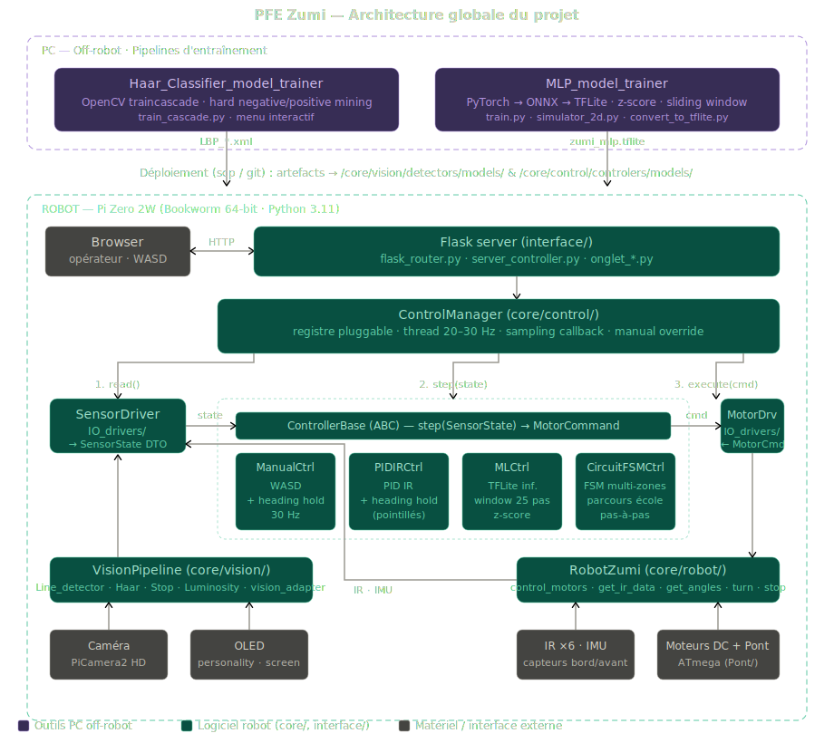

# PFE — Véhicule Autonome Miniature Zumi

> **Projet de fin d'études** — École de technologie supérieure (ÉTS), Département de génie de la production automatisée
> **Session** : Hiver 2026 — GPA 793
> **Équipe** : Cédric Senécal ; François Gagné ; Olivier Poitras ; Alycia-Rose Sévigny

---

## 1. Description du projet

Ce projet s'inscrit dans la continuité d'un PFE multi-session dont l'objectif est de concevoir un véhicule autonome miniature à partir du robot éducatif **Zumi** (Robolink). Nos pricipaux objectifs sont des contributions logicielles le but étant de s'affranchir de l'environnement de développement propriétaire de Robolink pour créer une plateforme logicielle flexible, modulaire et extensible, compatible avec les futures évolutions matérielles du robot. Nous souhaitons également explorer l'implantation de différents algorithmes d'apprentissage machine (ML) afin de comparer leur efficacité dans le contexte de la conduite autonome sur un robot à ressources limitées.

### Objectifs de la session courante

| # | Objectif | État |
|---|----------|------|
| 1 | **Migration matérielle** — Migrer du Pi Zero W (V1) au Pi Zero 2W (V2) : OS Bookworm 64-bit, Python 3.11, compatibilité SDK Zumi, drivers OLED et caméra. | Complété |
| 2 | **Modularisation** — Refactoriser le code monolithique en architecture modulaire (pattern Strategy) avec contrôleurs interchangeables et DTOs standardisés. | Complété |
| 3 | **Vision artificielle** — Implémenter et valider les détecteurs d'objets (HSV, Haar/LBP cascades) pour la signalisation routière, avec estimation de distance. | Complété |
| 4 | **Interface opérateur** — Serveur web Flask embarqué : contrôle du robot, live feed caméra, diagnostic de détection, réglage PID et collecte de données. | Complété |
| 5 | **Entraînement Haar/LBP** — Pipeline automatisé d'entraînement de cascades avec évaluation, hard negative mining et hard positive mining. | Complété |
| 6 | **Contrôle par apprentissage** — Contrôleur MLP avec pipeline PyTorch complet (entraînement, normalisation z-score, conversion TFLite, déploiement embarqué). | Complété |
| 7 | **Réseau AP+STA** — Point d'accès Wi-Fi permanent + connexion station simultanée via interface virtuelle sur puce unique. | Complété |
| 8 | **Continuité** — Documentation complète, transfert de connaissances et préparation pour les sessions futures. | Complété |

---

## 2. Architecture logicielle


*Vue d'ensemble du projet : pipelines d'entraînement PC (Haar et MLP) en haut, plateforme robot Pi Zero 2W en bas (UI web Flask → ControlManager → contrôleurs pluggables → robot). Complémentaire à l'arborescence ci-dessous.*

```
PFE/
├── main.py                          # Point d'entrée principal (robot)
├── README.md
├── LICENSE                          # Licence MIT
├── CHANGELOG.md                     # Historique des modifications
├── requirements-robot.txt           # Dépendances Python (robot)
├── project_architecture.svg        # Schéma d'architecture globale (inséré en tête de section)
│
├── script/                          # Scripts système embarqués
│   ├── zumi_ap_setup.sh             # Configuration initiale du profil AP (une seule fois)
│   ├── zumi_ap_sta_start.sh         # Démarrage AP+STA au boot (appelé par systemd)
│   ├── zumi_wifi_config.sh          # Configuration interactive de la connexion STA
│   ├── setup_dns_rpi.sh             # Configuration DNS du Raspberry Pi
│   └── zumi-ap.service              # Service systemd pour le point d'accès
│
├── core/                            # Couche métier embarquée
│   ├── camera/
│   │   ├── camera_base.py           # Interface abstraite caméra
│   │   ├── picam2.py                # Driver PiCamera2 (Raspberry Pi)
│   │   └── zumi_camera.py           # Wrapper Zumi (RGB → BGR)
│   │
│   ├── control/
│   │   ├── control_manager.py       # Orchestrateur pluggable des contrôleurs
│   │   ├── sensor_profiler.py       # Utilitaires de profilage des capteurs
│   │   ├── controlers/              # Implémentations concrètes (pattern Strategy)
│   │   │   ├── controller_base.py   # Interface abstraite contrôleur (ABC)
│   │   │   ├── manual_controller.py # Contrôle manuel (joystick)
│   │   │   ├── ml_controller.py     # Contrôleur prédictif MLP (TFLite)
│   │   │   ├── pid_ir_controller.py # Contrôleur PID par capteurs infrarouges
│   │   │   ├── circuit_fsm_controller.py # Contrôleur state-machine pour parcours complet
│   │   │   └── models/              # Artefacts de déploiement du MLP
│   │   │       ├── zumi_mlp.tflite           # Modèle TFLite déployé
│   │   │       ├── normalization_stats.json  # Stats z-score pour normalisation
│   │   │       └── environment_config.json   # Config d'environnement du modèle
│   │   └── IO_drivers/              # Couche traductrice robotique/framework (DTOs)
│   │       ├── motor_command.py
│   │       ├── motor_driver.py
│   │       ├── sensor_driver.py
│   │       └── sensor_state.py
│   │
│   ├── hardware/
│   │   ├── boot.py                  # Handshake Pi ↔ ATmega (patch compatibilité V2)
│   │   ├── personality.py           # Expressions et personnalité du robot
│   │   ├── screen.py                # Driver OLED (luma.oled — remplace Adafruit_SSD1306)
│   │   └── postbootup.service       # Service systemd handshake (V2)
│   │
│   ├── robot/
│   │   ├── robot_base.py            # Interface abstraite robot
│   │   └── robot_zumi.py            # Implémentation Zumi (moteurs, capteurs)
│   │
│   └── vision/
│       ├── vision_adapter.py        # Vectorisateur numérique (inférences ML)
│       ├── vision_pipeline.py       # Orchestrateur : capture → détection → résultats
│       └── detectors/
│           ├── detector_base.py     # Classe de base pour tous les détecteurs
│           ├── Line_detector.py     # Détecteur de lignes
│           ├── Luminosity.py        # Détecteur de luminosité
│           ├── Stop_detector_zumi.py
│           ├── Stop_detector_cv.py
│           ├── Stop_detector_matt.py
│           ├── Haar_classifier.py
│           └── models/              # Cascades entraînées (LBP_*.xml, stop_sign_classifier_2.xml)
│
├── interface/                       # Serveur Flask (UI opérateur)
│   ├── flask_router.py
│   ├── server_controller.py
│   ├── run_server.py
│   ├── mock_zumi.py
│   ├── onglet_acceuil.py
│   ├── onglet_control.py
│   ├── onglet_pid.py
│   ├── onglet_vision.py
│   └── onglet_template.py
│
├── Haar_Classifier_model_trainer/   # Pipeline d'entraînement Haar/LBP (PC-side)
│   ├── train_cascade.py             # Point d'entrée — menu interactif
│   ├── positive_image_downloader.py # Téléchargement d'images positives
│   ├── cascade/                     # Modules du pipeline (config, data_prep, training, evaluation, mining, analysis)
│   ├── requirements.txt
│   └── README.md                    # Guide complet du pipeline Haar — à lire avant utilisation
│
├── MLP_model_trainer/               # Pipeline d'entraînement MLP PyTorch (PC-side)
│   ├── train.py                     # Script d'entraînement interactif avec validation
│   ├── evaluate.py                  # Évaluation du modèle sur jeu de test
│   ├── dataset.py                   # Chargement JSONL → PyTorch DataLoader
│   ├── model.py                     # Architecture MLP (Small/Medium/Large)
│   ├── augment.py                   # Augmentation de données
│   ├── aggregate_sequences.py       # Agrégation des séquences de conduite
│   ├── analyze_dataset.py           # Analyse statistique du dataset
│   ├── convert_to_tflite.py         # Conversion PyTorch → ONNX → TFLite
│   ├── simulator_2d.py              # Simulateur 2D pour validation offline
│   ├── validate_env.py              # Validation de l'environnement d'entraînement
│   ├── requirements.txt
│   ├── GUIDE_UTILISATION.md         # Guide d'utilisation complet
│   └── TUTORIAL_MLP_PYTORCH.md      # Tutoriel complet PyTorch/MLP
│
├── Pont/                            # Code Arduino pour le pont (ATmega)
│   └── Pont.ino
│
└── Doc/                             # Documentation interne
    ├── GUIDE_GIT.md
    ├── ARCHITECTURE_CONTROLE.md         # Documentation architecture du module de contrôle
    ├── MIGRATION_NOTES.md               # Journal de migration Pi Zero W → Pi Zero 2W
    └── Procédure serveur flask.md
```

> **Non versionnés** (voir `.gitignore`) : `MLP_model_trainer/{sequences,checkpoints,export,Incubator}/`, caches Python, environnements virtuels. Ces dossiers sont régénérés par les équipes via le pipeline d'entraînement — voir section 7.2.

### Principes d'architecture

| Principe | Application |
|----------|-------------|
| **Abstraction matérielle** | Les interfaces `camera_base` et `robot_base` découplent le matériel du reste du système. Un changement de caméra ou de plateforme robot n'impacte pas la logique applicative. |
| **Couche de contrôle pluggable** | Le dossier `core/control/` utilise le pattern Strategy : chaque contrôleur hérite de `ControllerBase` et implémente `step(SensorState) → MotorCommand`. Le `ControlManager` orchestre le cycle lecture → inférence → exécution sans connaître les détails des contrôleurs. |
| **Pipeline de vision modulaire** | `vision_pipeline.py` orchestre la capture et la détection sans connaître les détecteurs spécifiques. Chaque détecteur hérite de `detector_base` et peut être ajouté ou retiré sans modifier le pipeline. |
| **Séparation entraînement / déploiement** | L'entraînement des modèles s'exécute sur PC (`Haar_Classifier_model_trainer/` pour les cascades, `MLP_model_trainer/` pour les réseaux de neurones). Seuls les artefacts (`.xml`, `.tflite`) sont déployés sur le robot. |
| **Interface opérateur découplée** | Le serveur Flask communique avec le pipeline de vision via une API Python interne, sans dépendance directe au matériel. |

---

## 3. Matériel

> **Note — Session Hiver 2026**
> La migration du Pi Zero W (V1) vers le Pi Zero 2W (V2) est **complétée**. Le V2 est désormais la plateforme active.
> La section V1 ci-dessous est conservée pour référence. Voir `MIGRATION_NOTES.md` pour le journal complet de la migration.

### Pi Zero W — V1 (configuration originale Robolink)

| Caractéristique | Valeur |
|-----------------|--------|
| **SoC** | Broadcom BCM2835 |
| **CPU** | ARM1176JZF-S (ARM11) — 1 cœur, 32-bit, 1 GHz |
| **RAM** | 512 Mo (partagée CPU/GPU) |
| **OS** | Raspbian (Debian) — Python 3.5.3 |
| **Réseau** | AP natif Zumi — `ssh pi@192.168.10.1` |
| **Alimentation** | 5 V / 1.2 A via Micro USB |

> **Contraintes V1 :** CPU monocœur 32-bit — algorithmes de vision légers obligatoires. Python 3.5.3 — pas de f-strings, encodage UTF-8 forcé (`# -*- coding: utf-8 -*-`).

### Pi Zero 2W — V2 (nouvelle configuration)

| Caractéristique | Valeur |
|-----------------|--------|
| **SoC** | Broadcom BCM2710A1 |
| **CPU** | Cortex-A53 — 4 cœurs, 64-bit, 1 GHz |
| **RAM** | 512 Mo |
| **OS** | Raspberry Pi OS Lite 64-bit (Bookworm) — Python 3.11.2 |
| **Réseau** | AP+STA simultané — `ssh pi@192.168.0.1` (voir section 4.2) |
| **Alimentation** | 5 V / 2.5 A via Micro USB (alimentation externe recommandée) |

> **Avantages V2 :** quad-core 64-bit — résolution caméra augmentée (HD), framerate jusqu'à 60 fps. Environnement Python moderne (3.11) dans venv isolé.

### Robot Zumi (Robolink) — commun aux deux configurations

| Caractéristique | Valeur |
|-----------------|--------|
| **Constructeur** | Robolink Inc. |
| **Caméra** | Pixy-like camera, flux 480p (V1) / HD (V2) |
| **Moteurs** | 2× moteurs DC (différentiel) |
| **Capteurs** | IR frontaux et arrière, accéléromètre, gyroscope |
| **Alimentation** | Batterie LiPo rechargeable |
| **API Python** | [Documentation Robolink](https://docs.robolink.com/docs/Zumi/Python/Function-Documentation) |

---

## 4. Démarrage rapide

### 4.1 — Pi Zero W V1 (configuration Robolink originale — historique)

> La plateforme V1 (Pi Zero W, Python 3.5) n'est plus maintenue. Le code spécifique au V1 et le script `zumi_prepare.sh` sont disponibles sur le tag `V1.0` du repo :
>
> ```bash
> git checkout V1.0
> ```
>
> Pour toute nouvelle session, **utiliser la procédure V2 ci-dessous**.

### 4.2 — Pi Zero 2W V2 (configuration active)

Le V2 démarre automatiquement en mode **AP+STA simultané** via le service `zumi-ap.service`.

**Connexion permanente via l'AP du robot (recommandé) :**

```bash
# 1. Se connecter au Wi-Fi du robot
#    SSID     : zumi-robot
#    Password : zumirobot

# 2. Connexion SSH via l'AP (toujours disponible, même sans réseau externe)
ssh pi@192.168.0.1
# Mot de passe : pi

# 3. Activer l'environnement virtuel (automatique si .bashrc configuré)
source ~/venv/bin/activate

# 4. Lancer le programme principal
cd ~/PFE
python3 main.py
```

**Connexion au réseau externe (STA) — pour git pull et accès Internet :**

```bash
# Configurer la connexion STA (à faire une seule fois, ou après changement de réseau)
sudo ~/PFE/script/zumi_wifi_config.sh
# Le script demande le SSID et le mot de passe du réseau cible.
# La connexion est persistée dans NetworkManager et s'active automatiquement au boot.

sudo nmcli connection up ZumiSTA
```

**Vérification de l'état réseau :**

```bash
ip addr show wlan0   # Interface STA — IP dynamique si connecté au réseau externe
ip addr show wlan1   # Interface AP  — 192.168.0.1 (toujours présente)
```
### 4.2.1 — Accès au serveur Flask via le réseau externe

```bash
# Récupérer l'IP STA (wlan0) assignée par le réseau
ip -c addr show wlan0

# Depuis un navigateur sur la même machine ou le même réseau :
# http://<ip_wlan0>:5000
```


### 4.3 — Entraînement d'un modèle (PC-side, commun V1/V2)

```bash
cd Haar_Classifier_model_trainer

# Installer les dépendances
pip install -r requirements.txt

# Lancer le menu interactif
python train_cascade.py
```

Voir [Haar_Classifier_model_trainer/README.md](Haar_Classifier_model_trainer/README.md) pour la documentation complète.

### 4.4 — Entraînement d'un modèle MLP (PC-side)

```bash
cd MLP_model_trainer

# Installer les dépendances
pip install -r requirements.txt

# Lancer l'entraînement
python train.py 

# Déployer sur le robot
scp export/zumi_mlp_quant.tflite pi@192.168.0.1:~/PFE/core/control/controlers/models/
```

Voir [MLP_model_trainer/GUIDE_UTILISATION.md](MLP_model_trainer/GUIDE_UTILISATION.md) pour le tutoriel complet.

---

## 5. Gestion des branches et tags

Tags de référence :

| Tag | Description |
|-----|-------------|
| `V0.1` | Première version fonctionnelle |
| `V1.0` | Dernière version Pi Zero W (32-bit, Python 3.5) — contient `zumi_prepare.sh` et le code V1 |
| `V2.0.0` | **Release finale PFE H2026** — plateforme Pi Zero 2W, architecture modulaire, contrôleurs MLP + PID + manuel |

Branche active :

| Branche | Description |
|---------|-------------|
| `main` | État de `V2.0.0` — point de départ recommandé pour forks et nouvelles sessions |

```bash
# Démarrer une feature à partir de main
git checkout main
git checkout -b feature/ma-fonctionnalite
```

Consulter [Doc/GUIDE_GIT.md](Doc/GUIDE_GIT.md) et [Doc/Workflow_GIT.md](Doc/Workflow_GIT.md) pour les conventions complètes.

---

## 6. Documentation

| Document | Description |
|----------|-------------|
| [CHANGELOG.md](CHANGELOG.md) | Historique détaillé des modifications par branche |
| [ARCHITECTURE_CONTROLE.md](ARCHITECTURE_CONTROLE.md) | Architecture détaillée du module de contrôle (pattern Strategy) |
| [MIGRATION_NOTES.md](MIGRATION_NOTES.md) | Journal complet de la migration Pi Zero W → Pi Zero 2W |
| [Haar_Classifier_model_trainer/README.md](Haar_Classifier_model_trainer/README.md) | Guide complet du pipeline d'entraînement Haar/LBP |
| [MLP_model_trainer/GUIDE_UTILISATION.md](MLP_model_trainer/GUIDE_UTILISATION.md) | Guide d'utilisation du pipeline MLP |
| [MLP_model_trainer/TUTORIAL_MLP_PYTORCH.md](MLP_model_trainer/TUTORIAL_MLP_PYTORCH.md) | Tutoriel complet : MLP avec PyTorch et déploiement TFLite |
| [Doc/GUIDE_GIT.md](Doc/GUIDE_GIT.md) | Guide Git pour les membres de l'équipe |
| [Doc/Procédure serveur flask.md](Doc/Proc%C3%A9dure%20serveur%20flask.md) | Procédure d'ajout d'endpoints au serveur Flask |

---

## 7. Continuer ce projet — équipes futures

Ce repo est livré au tag **V2.0.0** comme état final du PFE Hiver 2026. Il est destiné à servir de base de départ propre aux prochaines équipes qui poursuivront le développement du véhicule autonome Zumi.

### 7.1 — Forker le repo au tag V2.0.0

1. Aller sur [https://github.com/Sympoziium/PFE](https://github.com/Sympoziium/PFE)
2. Cliquer **Fork** (en haut à droite) pour créer votre propre copie du repo.
3. Cloner votre fork localement et se positionner sur le tag V2.0.0 :

```bash
git clone https://github.com/VOTRE-ORG/PFE.git
cd PFE
git checkout V2.0.0
git checkout -b main           # nouvelle branche de travail pour votre session
git push -u origin main
```

### 7.2 — Récupérer les artefacts non versionnés

Pour garder le repo léger, les **données d'entraînement** et les **modèles intermédiaires** ne sont pas versionnés (voir `.gitignore`). Les dossiers suivants sont absents du fork et devront être regénérés :

| Dossier | Contenu | Comment le regénérer |
|---------|---------|----------------------|
| `MLP_model_trainer/sequences/` | Séquences de conduite brutes (JSONL) | Mode manuel du serveur Flask + enregistrement |
| `MLP_model_trainer/checkpoints/` | Modèles PyTorch entraînés | `python train.py` (voir `MLP_model_trainer/GUIDE_UTILISATION.md`) |
| `MLP_model_trainer/export/` | Modèles ONNX / TFLite | `python convert_to_tflite.py` |
| `Haar_Classifier_model_trainer/data/` | Images positives/négatives | Voir `Haar_Classifier_model_trainer/README.md` |

Les derniers modèles entrainé seront déployé mais les artéfacte de modules ne sont pas sauvegarder, vous devrez échantillonner vous même si vous souhaitez entrainer un nouveau modèle. Référez vouz au guide de chacun des modules pour apprendre la procédure.

### 7.3 — Pistes d'évolution suggérées

Les axes suivants ont été identifiés pendant la session H2026 mais n'ont pas été complétés. Ils constituent de bonnes pistes de départ :

- Refonte du controleur ML vers un modèle d'architecture CNN : la vision est un concepte ultra important et qui fourni beaucoup plus de contexte que les capteurs. le robot arriverais a naviguer a travers le tapis très facilement si le livefeed vidéo étais directement dans son vecteur d'entrée
  

---

## 8. Licence

Ce projet est distribué sous licence **MIT** — voir [LICENSE](LICENSE) pour les termes complets.

Projet académique initial — ÉTS, Département de génie de la production automatisée, GPA 793 (Hiver 2026).
